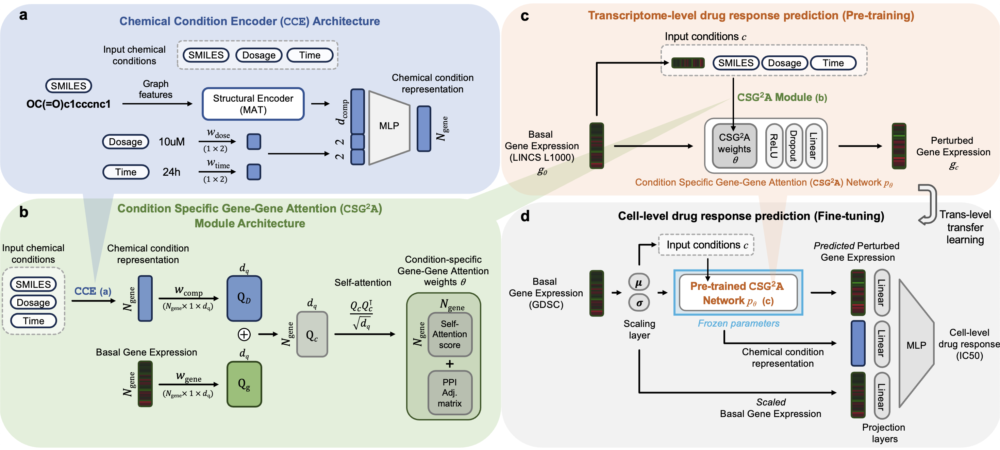

# CSG2A

The official code implementation for *Condition-Specific Gene-Gene Attention* ($CSG^2A$) network from our paper, "Transfer Learning of Condition-Specific Perturbation in Gene Interactions Improves Drug Response Prediction".

Here, we provide codes for pretraining our network in transcriptome data (including LINCS L1000 dataset) and finetuning our network in cell viability data (including GDSC dataset).

## Model description

The full model architecture is shown below. $CSG^2A$ network framework is composed of two steps:

Step 1. Pretraining of condition-specific response on LINCS L1000 dataset

Step 2. Fine-tuning of cell viability response on GDSC dataset



## Setup
First, clone this repository and move to the directory.
```
git clone https://github.com/eugenebang/CSG2A.git
cd CSG2A/
```

To install the appropriate environment for $CSG^2A" network, you should install [conda](https://docs.conda.io/en/latest/) package manager.

After installing `conda` and placing the `conda` executable in `PATH`, the following command will create `conda` environment named `csg2a`. It will take up to 10 minutes to setup the environment, but may vary upon the Internet connection and package cache states.
```
conda env create -f environment.yaml && \
conda activate csg2a
```

To check whether $CSG^2A$ network works properly, please refer to the Example codes section below.

## Example codes
Sample code to generate the embedding space and predict drug-disease associations are provided in [`finetune_GDSC.ipynb`](finetune_GDSC.ipynb).

- The file formats for each input file can be found in [here](data).

### Pretrained weights
We also provide the LINCS L1000-pretrained weights, utilizable for fine-tuning to cell viabilty drug reponse prediction tasks.

We note that we provide two versions; trained on [LINCS L1000 Landmark genes (total 978)](data/LINCS_L1000_landmark_genes.txt) and trained on [LINCS L1000 bing (infered) genes (total 10,167)](data/LINCS_L1000_bing_genes.txt). The experimental results in the manucript is all reported using the Landmark genes.

- Landmark pretrained model (Approx. 170MB; [link](https://drive.google.com/file/d/17-fFIxXB1avNZ9gWsccZ7Ia5Myqfzi9M/view))
- Bing (infered) pretrained model (Approx. 600MB; [link](https://drive.google.com/file/d/1YSafSPi-BreuVveAAtxc-zkMpm7qDjBb/view))

Also the pretrained MAT weights for training from scratch can be obtained from the [original author's repository](https://github.com/ardigen/MAT).

### Software requirements

**Operating system**

 $CSG^2A$ network training and evaluation were tested for *Linux* (Ubuntu 18.04) operating systems.

**Prerequisites**

$CSG^2A$ network training and evaluation were tested for the following python packages and versions.

  - `python`=3.10
  - `pytorch`=2.0.1
  - `rdkit`=2022.09.5
  - `numpy`=1.24.1
  - `pandas`=2.1.1
  - `scipy`=1.11.3
  - `tqdm`=4.66.1
